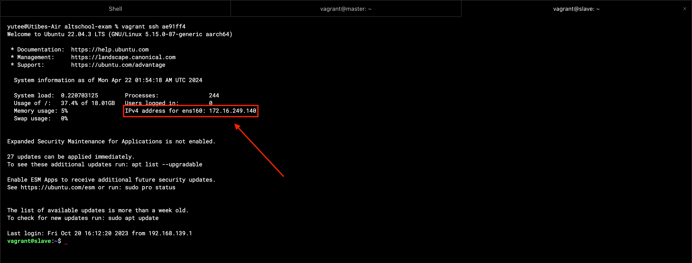
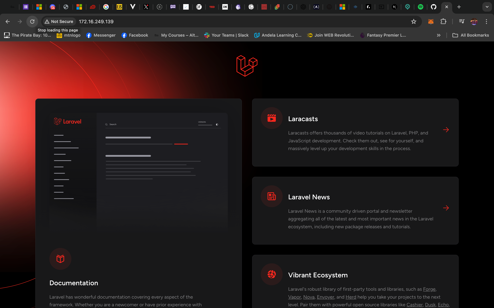

### Automating the deployment of a LAMP Stack Application Using Bash Script and Ansible

A LAMP stack is an open-source bundle of four different software technologies used by developers to build websites and web applications. LAMP is an acronym for the operating system, Linux; the web server, Apache; the database server, MySQL; and the programming language, PHP.

Developers use it to build web applications mostly because it is cost effective, has great support and it is easy to maintain. This is where we come in as Cloud/Devops engineers, figuring out how to take this web applications from development to deployment and monitoring it to ensure it is always available to our users.

In this documentation, I hope to walk through the steps I took to deploy and monitor the default Laravel PHP app. These steps cover using a bash script to get an app from github repository, setting it up on a server and using Ansible to provision another server to deploy same application. This bash script is reuseable with other Laravel applications of the same stack.

The whole process will be divided into __3__ steps:

- __Setting up Ubuntu vagrant machines__  

- __Creating a Bash Script to automate commands to configure and deploy a LAMP stack application__

- __Ansible Playbook to run the script on another server remotely and check server uptime daily__

>

#### 1. Setting up Ubuntu vagrant machines 
Vagrant helps in building virtual software development environments. It works with a virtual machine software and genrally helps to setup workable enviroments quickly and with less hassle.

Below is the Vagrantfile configurations I used to provision two Ubuntu servers. Master and Slave.  

With this single command:
> `Vagrant up`

I had two Ubuntu machines up and running and I successfully logged into them via ssh on my terminal.

The master has an ip address of ___172.16.249.138___
The slave has an ip address of ___172.16.249.139___

I now have two Ubuntu machines (Master & Slave) provisioned by Vagrant up and running.  

#### 2. Creating a Bash Script to automate commands to configure and deploy a LAMP stack application
Bash scripts are used to automate tasks that run on the server. In this case, the tasks and commands which will deploy the Php app will be automated using a reuseable Bash script.

On the master node, a file will be created in...

> `/home/vagrant/scripts/deploy_lamp_app.sh` 

The script handles the installation and configuration of tools and dependencies that ensure a PHP applications runs smoothly.

> ___deploy_lamp_app.sh___
>
> 

You can find the [script here](./deploy_lamp_app.sh)
It is clear and concise, but I will go through the major parts of what the script does.

- __Updates server and it's repository__
- __Installs Php8.2 and it's packages__
- __Installs MySQL, Apache and Git__
--  _Laravel specifically demands php 8.2 to ensure smooth running_
- __Installs Dependencies__
- __Installs Composer__ 
-- _A PHP dependency management tool_
- __Configures Apache web server__
- __Sets up a MySQL database for the application__

#### 3. Ansible Playbook to run the script on another server remotely and check server uptime daily
Ansible is a tool that automates the configuration, management and deployment of software applications and systems using the Infrastructure as code model.

For the next part of the project, ansible will be used to execute bashscript on a server remotely. The goal is to host the laravel app using by copying the bashscript from the master node to the slave node and running it there. All this will be done from the master node with the help of ansible. 

Link to the complete [project](./ansible/) and [playbook](./ansible/deploy.yaml)

The execution was acheived with these steps...

__Step 1:__ Install Ansible
> `sudo apt install ansible`

__Step 2:__ Create a connection between master and slave nodes using ssh.. 

__Step 3:__ Create project directory and files on master node

__Step 4:__ Edit inventory hosts file and the ansible configuration file

__Step 5:__ Confirm master and slave nodes are communicating properly using the ansible ping command...

__Step 6:__ Write playbbok and check correctness using...
>> `ansible-playbook deploy.yaml --check`

__Step 7:__ State of the server before running playbook

__Step 8:__ Run the playbook
_command to run the playbook_

_playbook run successful_

_application availability on the browser via the ip address 172.16.249.139 after playbook has been run_

